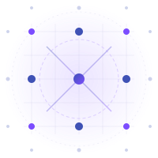

---
hide:
  - navigation
---

<div class="hero">

<h1>Optimal Hermite Lattices</h1>
<p class="subtitle">
A curated database of optimal on-lattice Gauss–Hermite quadrature rules in 1D, 2D, and 3D — designed for kinetic theory, lattice Boltzmann methods, and anyone who needs to integrate polynomials against Gaussians on a regular grid.
</p>
<p style="margin-top:0.5rem;">
<a href="lattice/lattice.dl" download class="md-button md-button--primary" style="font-size:0.9rem;">
⬇ Download lattice data (lattice.dl)
</a>
</p>
</div>

<div class="stats-row">
<div class="stat-box stat-box--compact">
  <div class="number">1D–3D</div>
  <div class="label">Dimensions</div>
</div>
<div class="stat-box stat-box--compact">
  <div class="number">675</div>
  <div class="label">Max quadrature points</div>
</div>
<div class="stat-box stat-box--compact">
  <div class="number">33</div>
  <div class="label">Max polynomial degree</div>
</div>
</div>

---

## What is this?

These lattices solve a deceptively elegant problem: **find the smallest set of equally-spaced points** (on a Cartesian grid) that can exactly integrate multivariate polynomials against the Gaussian weight function

$$
\int_{\mathbb{R}^d} f(\boldsymbol{\xi})\, \frac{e^{-|\boldsymbol{\xi}|^2/2}}{(2\pi)^{d/2}} \, d\boldsymbol{\xi} = \sum_{a} w_a \, f(c\,\boldsymbol{\xi}_a)
$$

where $\boldsymbol{\xi}_a$ are integer-coordinate points on a lattice with spacing $c$, and $w_a$ are the quadrature weights.

Unlike classical Gauss–Hermite quadrature (which uses irregularly spaced nodes), these rules live on a **regular lattice** — essential for lattice Boltzmann methods, discrete velocity models, and other applications where particles must travel between grid points in exact integer steps.

## Why does it matter?

In the **lattice Boltzmann method** (LBM), the discrete velocity set *is* the computational grid. The accuracy of macroscopic conservation laws — mass, momentum, energy, and higher-order stress tensors — depends directly on how well the velocity lattice integrates Hermite polynomial moments of the equilibrium distribution. These optimal lattices give the **minimum number of velocities needed** for a given order of accuracy.

## Getting started

<div class="lattice-grid">
<div class="lattice-card">
<a href="background/">
<h3>Background</h3>
<div class="meta">The mathematical framework: Hermite polynomials, Gauss–Hermite quadrature, and the lattice constraint.</div>
</a>
</div>
<div class="lattice-card">
<a href="methods/">
<h3>Methods</h3>
<div class="meta">How these lattices are computed: characteristic matrices, root-finding, and integer programming.</div>
</a>
</div>
<div class="lattice-card">
<a href="catalog/">
<h3>Lattice Catalog</h3>
<div class="meta">Browse all 35 lattice rules with full weights, abscissas, and spacing values.</div>
</a>
</div>
</div>

---

## All lattices at a glance

<table class="lattice-table">
<thead>
<tr><th>Name</th><th style="text-align:center">Dim</th><th style="text-align:center">Points</th><th style="text-align:center">Degree</th><th style="text-align:center">Layer</th><th>Spacing <em>c</em></th></tr>
</thead>
<tbody>
<tr class="row-d1"><td><a href="lattices/D1Q3/">D1Q3</a></td><td style="text-align:center">1D</td><td style="text-align:center">3</td><td style="text-align:center">2</td><td style="text-align:center">1</td><td><code>1.73205080…</code></td></tr>
<tr class="row-d1"><td><a href="lattices/D1Q7/">D1Q7</a></td><td style="text-align:center">1D</td><td style="text-align:center">7</td><td style="text-align:center">4</td><td style="text-align:center">3</td><td><code>1.19697977…</code></td></tr>
<tr class="row-d1"><td><a href="lattices/D1Q11/">D1Q11</a></td><td style="text-align:center">1D</td><td style="text-align:center">11</td><td style="text-align:center">6</td><td style="text-align:center">5</td><td><code>0.97000849…</code></td></tr>
<tr class="row-d1"><td><a href="lattices/D1Q15/">D1Q15</a></td><td style="text-align:center">1D</td><td style="text-align:center">15</td><td style="text-align:center">8</td><td style="text-align:center">7</td><td><code>0.83692040…</code></td></tr>
<tr class="row-d1"><td><a href="lattices/D1Q17/">D1Q17</a></td><td style="text-align:center">1D</td><td style="text-align:center">17</td><td style="text-align:center">10</td><td style="text-align:center">9</td><td><code>0.74689485…</code></td></tr>
<tr class="row-d1"><td><a href="lattices/D1Q21/">D1Q21</a></td><td style="text-align:center">1D</td><td style="text-align:center">21</td><td style="text-align:center">12</td><td style="text-align:center">11</td><td><code>0.68080678…</code></td></tr>
<tr class="row-d1"><td><a href="lattices/D1Q25/">D1Q25</a></td><td style="text-align:center">1D</td><td style="text-align:center">25</td><td style="text-align:center">14</td><td style="text-align:center">13</td><td><code>0.62963740…</code></td></tr>
<tr class="row-d1"><td><a href="lattices/D1Q27/">D1Q27</a></td><td style="text-align:center">1D</td><td style="text-align:center">27</td><td style="text-align:center">16</td><td style="text-align:center">15</td><td><code>0.58850475…</code></td></tr>
<tr class="row-d1"><td><a href="lattices/D1Q27a/">D1Q27a</a></td><td style="text-align:center">1D</td><td style="text-align:center">27</td><td style="text-align:center">18</td><td style="text-align:center">17</td><td><code>0.55450561…</code></td></tr>
<tr class="row-d1"><td><a href="lattices/D1Q29/">D1Q29</a></td><td style="text-align:center">1D</td><td style="text-align:center">29</td><td style="text-align:center">20</td><td style="text-align:center">19</td><td><code>0.52579099…</code></td></tr>
<tr class="row-d2"><td><a href="lattices/D2Q9/">D2Q9</a></td><td style="text-align:center">2D</td><td style="text-align:center">9</td><td style="text-align:center">5</td><td style="text-align:center">1</td><td><code>1.73205080…</code></td></tr>
<tr class="row-d2"><td><a href="lattices/D2Q17a/">D2Q17a</a></td><td style="text-align:center">2D</td><td style="text-align:center">17</td><td style="text-align:center">7</td><td style="text-align:center">3</td><td><code>1.64343060…</code></td></tr>
<tr class="row-d2"><td><a href="lattices/D2Q17b/">D2Q17b</a></td><td style="text-align:center">2D</td><td style="text-align:center">17</td><td style="text-align:center">7</td><td style="text-align:center">3</td><td><code>1.64947240…</code></td></tr>
<tr class="row-d2"><td><a href="lattices/D2Q17c/">D2Q17c</a></td><td style="text-align:center">2D</td><td style="text-align:center">17</td><td style="text-align:center">7</td><td style="text-align:center">3</td><td><code>1.15470053…</code></td></tr>
<tr class="row-d2"><td><a href="lattices/D2Q17d/">D2Q17d</a></td><td style="text-align:center">2D</td><td style="text-align:center">17</td><td style="text-align:center">7</td><td style="text-align:center">3</td><td><code>0.81649658…</code></td></tr>
<tr class="row-d2"><td><a href="lattices/D2Q37/">D2Q37</a></td><td style="text-align:center">2D</td><td style="text-align:center">37</td><td style="text-align:center">9</td><td style="text-align:center">3</td><td><code>1.19697977…</code></td></tr>
<tr class="row-d2"><td><a href="lattices/D2Q49a/">D2Q49a</a></td><td style="text-align:center">2D</td><td style="text-align:center">49</td><td style="text-align:center">11</td><td style="text-align:center">5</td><td><code>0.92469962…</code></td></tr>
<tr class="row-d2"><td><a href="lattices/D2Q49b/">D2Q49b</a></td><td style="text-align:center">2D</td><td style="text-align:center">49</td><td style="text-align:center">11</td><td style="text-align:center">5</td><td><code>1.10594054…</code></td></tr>
<tr class="row-d2"><td><a href="lattices/D2Q49c/">D2Q49c</a></td><td style="text-align:center">2D</td><td style="text-align:center">49</td><td style="text-align:center">11</td><td style="text-align:center">5</td><td><code>1.04213322…</code></td></tr>
<tr class="row-d2"><td><a href="lattices/D2Q49d/">D2Q49d</a></td><td style="text-align:center">2D</td><td style="text-align:center">49</td><td style="text-align:center">11</td><td style="text-align:center">5</td><td><code>1.15004776…</code></td></tr>
<tr class="row-d2"><td><a href="lattices/D2Q49e/">D2Q49e</a></td><td style="text-align:center">2D</td><td style="text-align:center">49</td><td style="text-align:center">11</td><td style="text-align:center">5</td><td><code>0.92161012…</code></td></tr>
<tr class="row-d2"><td><a href="lattices/D2Q49f/">D2Q49f</a></td><td style="text-align:center">2D</td><td style="text-align:center">49</td><td style="text-align:center">11</td><td style="text-align:center">5</td><td><code>0.75593681…</code></td></tr>
<tr class="row-d2"><td><a href="lattices/D2Q49g/">D2Q49g</a></td><td style="text-align:center">2D</td><td style="text-align:center">49</td><td style="text-align:center">11</td><td style="text-align:center">5</td><td><code>1.04243468…</code></td></tr>
<tr class="row-d2"><td><a href="lattices/D2Q49h/">D2Q49h</a></td><td style="text-align:center">2D</td><td style="text-align:center">49</td><td style="text-align:center">11</td><td style="text-align:center">5</td><td><code>0.93699204…</code></td></tr>
<tr class="row-d2"><td><a href="lattices/D2Q49i/">D2Q49i</a></td><td style="text-align:center">2D</td><td style="text-align:center">49</td><td style="text-align:center">11</td><td style="text-align:center">5</td><td><code>0.89401908…</code></td></tr>
<tr class="row-d2"><td><a href="lattices/D2Q77/">D2Q77</a></td><td style="text-align:center">2D</td><td style="text-align:center">77</td><td style="text-align:center">13</td><td style="text-align:center">5</td><td><code>0.97000849…</code></td></tr>
<tr class="row-d2"><td><a href="lattices/D2Q137/">D2Q137</a></td><td style="text-align:center">2D</td><td style="text-align:center">137</td><td style="text-align:center">17</td><td style="text-align:center">7</td><td><code>0.83692040…</code></td></tr>
<tr class="row-d2"><td><a href="lattices/D2Q205/">D2Q205</a></td><td style="text-align:center">2D</td><td style="text-align:center">205</td><td style="text-align:center">21</td><td style="text-align:center">9</td><td><code>0.74689485…</code></td></tr>
<tr class="row-d2"><td><a href="lattices/D2Q293/">D2Q293</a></td><td style="text-align:center">2D</td><td style="text-align:center">293</td><td style="text-align:center">25</td><td style="text-align:center">11</td><td><code>0.68080678…</code></td></tr>
<tr class="row-d2"><td><a href="lattices/D2Q353/">D2Q353</a></td><td style="text-align:center">2D</td><td style="text-align:center">353</td><td style="text-align:center">29</td><td style="text-align:center">13</td><td><code>0.62963740…</code></td></tr>
<tr class="row-d2"><td><a href="lattices/D2Q413/">D2Q413</a></td><td style="text-align:center">2D</td><td style="text-align:center">413</td><td style="text-align:center">33</td><td style="text-align:center">15</td><td><code>0.58850475…</code></td></tr>
<tr class="row-d3"><td><a href="lattices/D3Q15/">D3Q15</a></td><td style="text-align:center">3D</td><td style="text-align:center">15</td><td style="text-align:center">2</td><td style="text-align:center">1</td><td><code>1.73205080…</code></td></tr>
<tr class="row-d3"><td><a href="lattices/D3Q103/">D3Q103</a></td><td style="text-align:center">3D</td><td style="text-align:center">103</td><td style="text-align:center">4</td><td style="text-align:center">3</td><td><code>1.19697977…</code></td></tr>
<tr class="row-d3"><td><a href="lattices/D3Q327/">D3Q327</a></td><td style="text-align:center">3D</td><td style="text-align:center">327</td><td style="text-align:center">6</td><td style="text-align:center">5</td><td><code>0.97000849…</code></td></tr>
<tr class="row-d3"><td><a href="lattices/D3Q675/">D3Q675</a></td><td style="text-align:center">3D</td><td style="text-align:center">675</td><td style="text-align:center">8</td><td style="text-align:center">7</td><td><code>0.83692040…</code></td></tr>
</tbody>
</table>

---

## Lattice behavior

Interactive plots exploring how the number of quadrature points and the lattice spacing scale with polynomial degree across dimensions.

<div id="chart-points-vs-degree" style="width:100%;max-width:800px;height:480px;margin:1rem auto;"></div>

<div id="chart-spacing-vs-degree" style="width:100%;max-width:800px;height:480px;margin:1rem auto;"></div>

<div id="chart-points-vs-spacing" style="width:100%;max-width:800px;height:480px;margin:1rem auto;"></div>

<script src="https://cdn.plot.ly/plotly-2.35.2.min.js" charset="utf-8"></script>
<script>
(function() {
  // Inline data to avoid fetch issues with file:// protocol
  var DATA = {
    "D1": [
      {"name":"D1Q3","num_points":3,"degree":2,"spacing":1.732},
      {"name":"D1Q7","num_points":7,"degree":4,"spacing":1.197},
      {"name":"D1Q11","num_points":11,"degree":6,"spacing":0.970},
      {"name":"D1Q15","num_points":15,"degree":8,"spacing":0.837},
      {"name":"D1Q17","num_points":17,"degree":10,"spacing":0.747},
      {"name":"D1Q21","num_points":21,"degree":12,"spacing":0.681},
      {"name":"D1Q25","num_points":25,"degree":14,"spacing":0.630},
      {"name":"D1Q27","num_points":27,"degree":16,"spacing":0.589},
      {"name":"D1Q27a","num_points":27,"degree":18,"spacing":0.555},
      {"name":"D1Q29","num_points":29,"degree":20,"spacing":0.526}
    ],
    "D2": [
      {"name":"D2Q9","num_points":9,"degree":5,"spacing":1.732},
      {"name":"D2Q17a","num_points":17,"degree":7,"spacing":1.643},
      {"name":"D2Q17b","num_points":17,"degree":7,"spacing":1.649},
      {"name":"D2Q17c","num_points":17,"degree":7,"spacing":1.155},
      {"name":"D2Q17d","num_points":17,"degree":7,"spacing":0.816},
      {"name":"D2Q37","num_points":37,"degree":9,"spacing":1.197},
      {"name":"D2Q49a","num_points":49,"degree":11,"spacing":0.925},
      {"name":"D2Q49b","num_points":49,"degree":11,"spacing":1.106},
      {"name":"D2Q49c","num_points":49,"degree":11,"spacing":1.042},
      {"name":"D2Q49d","num_points":49,"degree":11,"spacing":1.150},
      {"name":"D2Q49e","num_points":49,"degree":11,"spacing":0.922},
      {"name":"D2Q49f","num_points":49,"degree":11,"spacing":0.756},
      {"name":"D2Q49g","num_points":49,"degree":11,"spacing":1.042},
      {"name":"D2Q49h","num_points":49,"degree":11,"spacing":0.937},
      {"name":"D2Q49i","num_points":49,"degree":11,"spacing":0.894},
      {"name":"D2Q77","num_points":77,"degree":13,"spacing":0.970},
      {"name":"D2Q137","num_points":137,"degree":17,"spacing":0.837},
      {"name":"D2Q205","num_points":205,"degree":21,"spacing":0.747},
      {"name":"D2Q293","num_points":293,"degree":25,"spacing":0.681},
      {"name":"D2Q353","num_points":353,"degree":29,"spacing":0.630},
      {"name":"D2Q413","num_points":413,"degree":33,"spacing":0.589}
    ],
    "D3": [
      {"name":"D3Q15","num_points":15,"degree":2,"spacing":1.732},
      {"name":"D3Q103","num_points":103,"degree":4,"spacing":1.197},
      {"name":"D3Q327","num_points":327,"degree":6,"spacing":0.970},
      {"name":"D3Q675","num_points":675,"degree":8,"spacing":0.837}
    ]
  };

  var colors = {"D1":"#2196f3","D2":"#4caf50","D3":"#ff9800"};
  var dimLabels = {"D1":"1D","D2":"2D","D3":"3D"};
  var layoutBase = {
    font: {family: "Inter, sans-serif", size: 13},
    paper_bgcolor: "rgba(0,0,0,0)",
    plot_bgcolor: "rgba(0,0,0,0)",
    margin: {l:60, r:30, t:50, b:80},
    legend: {orientation:"h", y:-0.25, x:0.5, xanchor:"center"}
  };

  // ── Chart 1: Points vs Degree ──
  var traces1 = [];
  ["D1","D2","D3"].forEach(function(dk) {
    var d = DATA[dk];
    // For the "min points" envelope, pick only unique-degree entries with the smallest point count
    var byDeg = {};
    d.forEach(function(e){ if(!byDeg[e.degree] || e.num_points < byDeg[e.degree].num_points) byDeg[e.degree]=e; });
    var envelope = Object.values(byDeg).sort(function(a,b){return a.degree-b.degree;});
    traces1.push({
      x: envelope.map(function(e){return e.degree;}),
      y: envelope.map(function(e){return e.num_points;}),
      text: envelope.map(function(e){return e.name;}),
      mode: "lines+markers",
      name: dimLabels[dk] + " (min pts)",
      line: {color: colors[dk], width: 2.5},
      marker: {size: 8}
    });
    // Also show all points as faint markers
    traces1.push({
      x: d.map(function(e){return e.degree;}),
      y: d.map(function(e){return e.num_points;}),
      text: d.map(function(e){return e.name;}),
      mode: "markers",
      name: dimLabels[dk] + " (all)",
      marker: {size: 5, color: colors[dk], opacity: 0.35},
      showlegend: false
    });
  });
  Plotly.newPlot("chart-points-vs-degree", traces1, Object.assign({}, layoutBase, {
    title: {text:"Quadrature Points vs Polynomial Degree", font:{size:16}},
    xaxis: {title:"Polynomial degree", gridcolor:"rgba(0,0,0,0.08)", zeroline:false},
    yaxis: {title:"Number of points", gridcolor:"rgba(0,0,0,0.08)", zeroline:false}
  }), {responsive:true, displayModeBar:false});

  // ── Chart 2: Spacing vs Degree ──
  var traces2 = [];
  ["D1","D2","D3"].forEach(function(dk) {
    var d = DATA[dk];
    var byDeg = {};
    d.forEach(function(e){ if(!byDeg[e.degree] || e.num_points < byDeg[e.degree].num_points) byDeg[e.degree]=e; });
    var envelope = Object.values(byDeg).sort(function(a,b){return a.degree-b.degree;});
    traces2.push({
      x: envelope.map(function(e){return e.degree;}),
      y: envelope.map(function(e){return e.spacing;}),
      text: envelope.map(function(e){return e.name;}),
      mode: "lines+markers",
      name: dimLabels[dk],
      line: {color: colors[dk], width: 2.5},
      marker: {size: 8}
    });
    traces2.push({
      x: d.map(function(e){return e.degree;}),
      y: d.map(function(e){return e.spacing;}),
      text: d.map(function(e){return e.name;}),
      mode: "markers",
      marker: {size: 5, color: colors[dk], opacity: 0.35},
      showlegend: false
    });
  });
  Plotly.newPlot("chart-spacing-vs-degree", traces2, Object.assign({}, layoutBase, {
    title: {text:"Lattice Spacing c vs Polynomial Degree", font:{size:16}},
    xaxis: {title:"Polynomial degree", gridcolor:"rgba(0,0,0,0.08)", zeroline:false},
    yaxis: {title:"Spacing c", gridcolor:"rgba(0,0,0,0.08)", zeroline:false}
  }), {responsive:true, displayModeBar:false});

  // ── Chart 3: Points vs Spacing (bubble = degree) ──
  var traces3 = [];
  ["D1","D2","D3"].forEach(function(dk) {
    var d = DATA[dk];
    traces3.push({
      x: d.map(function(e){return e.spacing;}),
      y: d.map(function(e){return e.num_points;}),
      text: d.map(function(e){return e.name + "<br>degree " + e.degree;}),
      mode: "markers",
      name: dimLabels[dk],
      marker: {
        size: d.map(function(e){return 6 + e.degree * 0.6;}),
        color: colors[dk],
        opacity: 0.7,
        line: {width: 1, color: "white"}
      }
    });
  });
  Plotly.newPlot("chart-points-vs-spacing", traces3, Object.assign({}, layoutBase, {
    title: {text:"Points vs Spacing (bubble size = degree)", font:{size:16}},
    xaxis: {title:"Spacing c", gridcolor:"rgba(0,0,0,0.08)", zeroline:false},
    yaxis: {title:"Number of points", gridcolor:"rgba(0,0,0,0.08)", zeroline:false}
  }), {responsive:true, displayModeBar:false});
})();
</script>

---

## Citation

If you use these lattices in your research, please cite:

> T. Nakprapatsorn, P. Wongwaitayakornkul, K. Malakit, T. Pianpanit, and D. Ruffolo, "Accuracy of two-dimensional high-order lattice Boltzmann method with regularization for transition flows," *Phys. Fluids*, vol. 37, no. 2, 2025.

```bibtex
@article{nakprapatsorn2025accuracy,
  title={Accuracy of two-dimensional high-order lattice Boltzmann method with regularization for transition flows},
  author={Nakprapatsorn, Thapana and Wongwaitayakornkul, Pakorn and Malakit, Kittipat and Pianpanit, Theerasarn and Ruffolo, David},
  journal={Physics of Fluids},
  volume={37},
  number={2},
  year={2025},
  publisher={AIP Publishing}
}
```

---

<p style="text-align:center; color: var(--md-default-fg-color--light); font-size:0.85rem;">
Data by Pakorn Wongwaitayakornkul
</p>
